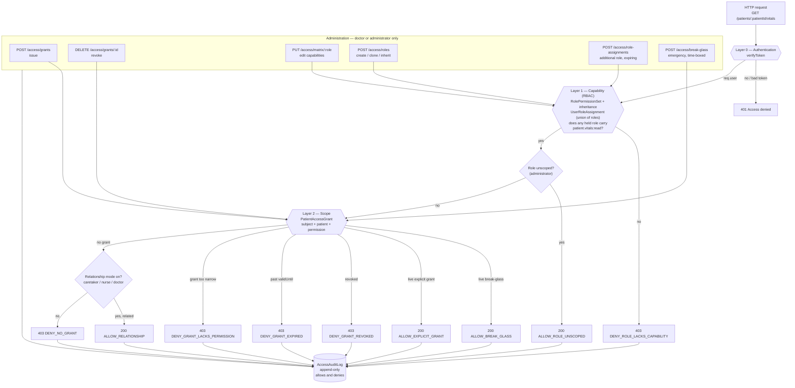

# Guardian — access control decision flow

**Author:** Graeme Thomas  
**Module:** `guardian-access-control` v1.1.0

GitHub renders Mermaid inside a fenced block in Markdown, but shows a bare
`.mermaid` file as plain text. This page is therefore the version that renders
in a pull request; `patient-access-control.mermaid` is the source you edit, and
`patient-access-control.svg` is the export for slides and documents.

## Decision flow

## Reading it

Layer 1 is RBAC and answers *what kind of action*. Layer 2 is patient scope and
answers *for which patient*. A request must clear both. Every outcome — allow
and deny alike — is written to `AccessAuditLog` with its reason code.

The administration box feeds both layers: grants and break-glass change scope,
while role, matrix and assignment changes change capability.
